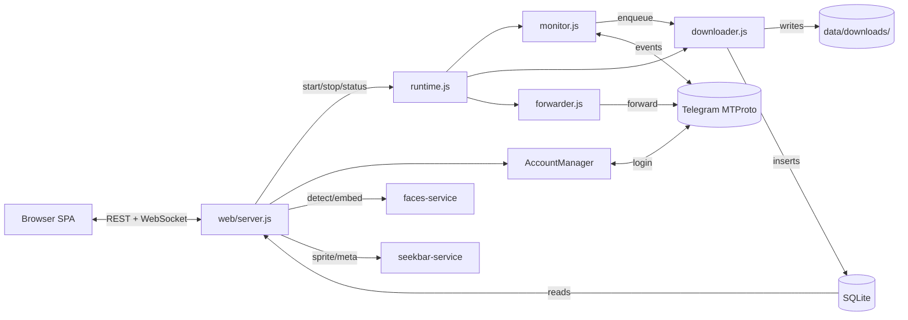

# Telegram Media Downloader — self-hosted, free, MIT

> **The best self-hosted Telegram media downloader for 2026.** Download photos, videos, documents, voice messages, GIFs, stickers, and Stories from any Telegram channel, group, supergroup, forum topic, or DM your Telegram account can read. Bulk-archive a whole channel, paste a `t.me/` link to grab a single message, capture self-destructing (TTL) media before it expires, auto-forward to another chat, share files with HMAC-signed links, mirror to S3 / R2 / B2 / Wasabi / SFTP / Google Drive / Dropbox, run a cross-machine **cluster** with real-time sync and automatic failover, detect and cluster **faces with AI** (insightface + DBSCAN — photos and videos), generate **seekbar timeline previews** for video hover, and one-click update from the browser via a watchtower sidecar. Web dashboard + CLI. Bilingual (English / ไทย). Runs on Windows, Linux, macOS, Raspberry Pi, NAS, and Docker (amd64 + arm64).

[](https://github.com/botnick/telegram-media-downloader/actions/workflows/ci.yml)
[](https://github.com/botnick/telegram-media-downloader/actions/workflows/codeql.yml)
[](./LICENSE)
[](https://nodejs.org/)
[](https://github.com/botnick/telegram-media-downloader/pkgs/container/telegram-media-downloader)
[](https://github.com/botnick/telegram-media-downloader/releases)
[](https://github.com/botnick/telegram-media-downloader/actions)

> **Keywords:** Telegram downloader · Telegram channel scraper · Telegram media backup · Telegram bulk download · download Telegram videos · download Telegram photos · download Telegram voice messages · download Telegram documents · Telegram archive tool · Telegram backup tool · self-hosted Telegram bot alternative · Telegram User API client · GramJS · MTProto · Telegram Stories downloader · Telegram private channel downloader · t.me link downloader · Telegram TTL self-destruct downloader · Telegram NSFW filter · Telegram cluster mode · Telegram multi-machine sync · Telegram dashboard · Telegram media manager · Telegram desktop alternative · self-hosted Telegram archiver · Telegram channel mirror · Telegram media server · open-source Telegram downloader · MIT-licensed Telegram tool · Docker Telegram downloader · Raspberry Pi Telegram downloader · NAS Telegram downloader · Synology Telegram downloader · Telegram face recognition · Telegram AI face detection · insightface face clustering · DBSCAN people grouping · video face detection · Telegram seekbar preview · GPU-accelerated video thumbnails · Telegram media organizer · Telegram deduplication · Telegram auto-forward · Telegram share link · S3 backup Telegram · SFTP backup Telegram · Google Drive backup Telegram · Dropbox backup Telegram · Telegram multi-account · Telegram forum topic downloader · Telegram sticker downloader · Telegram GIF downloader · Telegram audio downloader.

> [Quick start](#quick-start) · [What's new in v2.18](#whats-new-in-v2180) · [Cluster mode](docs/CLUSTER.md) · [AI face clustering](docs/AI.md) · [Architecture](docs/ARCHITECTURE.md) · [API reference](docs/API.md) · [Deploy](docs/DEPLOY.md) · [Backup providers](docs/BACKUP.md) · [Troubleshooting](docs/TROUBLESHOOTING.md) · [Migration v2.9 → v2.10](docs/MIGRATION-v2.9-to-v2.10.md) · [Audit](docs/AUDIT.md)

## What's new in v2.18.0

- **Video face detection** — opt-in "Include videos in face scan" toggle. The sidecar extracts frames via OpenCV, detects faces in each frame, and clusters them alongside photo-sourced faces in the same DBSCAN pass. People who appear in both photos and videos land in one cluster.
- **Model picker + preload** — dropdown offers **buffalo_l** (default), **antelopev2** (ResNet100, best accuracy), **buffalo_m**, and **buffalo_s**. Selecting a model triggers a background download before the sidecar restarts. All presets produce 512-dim embeddings — switching doesn't require re-scanning.
- **Video badge on People grid** — amber film icon per person card when they appear in videos. A "Video" filter chip shows only people from video sources.
- **CPU throttle for face scanning** — duty-cycle rest (`cpuThrottleRatio`, default 0.5). GPU users can set 0.
- **Thumbnail auto-generate toggle** — `advanced.thumbs.autoOnDownload` config with a toggle on Maintenance → Thumbnails.
- **GPU scaler probe** — ffmpeg `scale_cuda` / `scale_vaapi` / `vpp_qsv` probed at boot; missing filter falls back to software scale while keeping GPU decode.
- **Orphan cleanup trigger** — SQLite trigger `trg_purge_orphan_people` auto-deletes people rows when all their faces are cascade-deleted.
- **Doctor gates scan buttons** — Scan / Reindex / Re-cluster buttons disabled until all health checks pass.
- **Security hardening** — constant-time token comparison in seekbar sidecar, TOCTOU symlink protection in faces sidecar, ffmpeg arg injection blocklist, log rotation for all log files, SpamGuard memory caps, event listener leak fixes.

<details>
<summary>v2.17.0</summary>

- **Seekbar timeline previews** — Netflix / YouTube-style hover thumbnails on the video player. Go sidecar generates WebP sprite sheets; viewer paints a 160 px tile + time pill on scrub. Off by default — enable in Maintenance → Seekbar previews.
- **Maintenance → Seekbar previews page** — master + auto-on-download toggles, KPI strip, tunable settings, JobTracker-driven Scan + Cancel + Wipe cache.
- **Face clustering on Python sidecar** — insightface `buffalo_l` (512-dim ArcFace, MIT). Auto-spawns from PyInstaller binary or falls back to `python -m tgdl_faces`.
- **Multi-platform GPU acceleration** — DirectML (Windows), CUDA (NVIDIA), OpenVINO (Intel), CoreML (Apple Silicon), CPU everywhere else.

Full ship list in [CHANGELOG.md](CHANGELOG.md).
</details>

### One-click deploy

| Provider | Button |
| --- | --- |
| **Render** | [](https://render.com/deploy?repo=https://github.com/botnick/telegram-media-downloader) |
| **Railway** | [](https://railway.app/template/?template=https://github.com/botnick/telegram-media-downloader) |
| **Fly.io / Docker** | `docker run --pull=always -p 3000:3000 -v "$(pwd)/data:/app/data" ghcr.io/botnick/telegram-media-downloader:latest` |

After the container is up, open `:3000` and the in-browser setup wizard takes over (set password → enter API creds → add account → download).

### Architecture at a glance



Detail in [`docs/ARCHITECTURE.md`](docs/ARCHITECTURE.md).

---

## What is Telegram Media Downloader?

A self-hosted application that watches your Telegram chats and downloads new media to disk automatically. Built on the **Telegram User API (MTProto via [GramJS](https://github.com/gram-js/gramjs))** — not a bot — so it can read any channel, group, supergroup, forum topic, or DM your Telegram account is a member of, including private ones. Files are organised into folders by chat and media type, deduplicated in a local SQLite database, and viewable in a Telegram-themed web dashboard. No quotas, no cloud, no telemetry.

## Why people use it

- **Archive a whole Telegram channel** — bulk-backfill thousands of past messages with date / count filters.
- **Mirror an active channel** — real-time monitor downloads new media the moment it arrives.
- **Save individual messages** — paste a `https://t.me/...` link, get the media into your library.
- **Save Stories** — pull active Stories from any user by username.
- **Capture self-destructing media** — TTL messages are fast-pathed to the front of the queue and stored locally before they expire.
- **Avoid Telegram bot limits** — User API has no 50 MB / 4 GB ceiling that the Bot API imposes.
- **Forward as you download** — auto-forward to another channel, group, or Saved Messages.
- **Share without logging in** — admin generates HMAC-signed `/share/<id>` URLs that friends can open or feed to a download manager (TTL configurable, including "never expires").
- **Backup off-host** — multi-provider mirror to S3-compatible storage (AWS / R2 / B2 / MinIO / Wasabi), an SFTP NAS, Google Drive, Dropbox, or a local mount. Continuous mirror, scheduled tar.gz snapshots, optional AES-256-GCM encryption, persistent retry queue.
- **Find duplicates** — SHA-256 dedup at download time + on-demand library scan.
- **Sort 18+ vs not-18+** — opt-in in-process classifier (`@huggingface/transformers`, WASM) flags photos for review.
- **Recognize faces** — opt-in Python sidecar (insightface + DBSCAN) clusters faces from photos **and videos** into a People grid. Multiple model presets, GPU acceleration, CPU throttle.
- **Seekbar timeline previews** — Go sidecar generates WebP sprite-sheet hover thumbnails for the video player (Netflix / YouTube-style).
- **Run a cluster** — pair two or more dashboards into a federated library with real-time sync, automatic failover, LAN auto-discovery, relay-through-peer, cross-peer delete. See [docs/CLUSTER.md](docs/CLUSTER.md).
- **One-click update** — opt-in watchtower sidecar; DB snapshotted first, full audit trail.
- **Desktop-class gallery** — right-click context menu, drag-drop URL, pinned items, picture-in-picture, mini-player, bulk-zip download, system notifications, wake lock, sunrise/sunset theme, keyboard shortcuts.
- **Fast on slow hardware** — hash worker pool, HTTP compression, immutable static caching, modulepreload. Runs on a Pi 4 / NAS.

## Complete feature list

### Engine
- Realtime monitor across unlimited channels, groups, supergroups, and forum topics.
- **Monitor resumes last state** on restart — if running before shutdown it auto-starts; if stopped it stays stopped. Persisted via `monitor.autoStart` in config.
- **Smart-resume backfill** — `iterMessages` skips already-stored ranges via `maxId/minId` instead of walking the whole timeline.
- **Auto-backfill on first add** — new group triggers background pull of most recent N messages (default 100, configurable, 0 = disabled).
- **Auto catch-up after restart** — boots with a `catch-up` backfill when gap exceeds threshold.
- **Per-group lock** — one backfill per group; duplicate request returns 409 `ALREADY_RUNNING`.
- **Backfill modes** — `pull-older` / `catch-up` / `rescan`, surfaced over WS.
- **Multi-account routing** — unlimited Telegram accounts. Engine probes which account can read each chat; per-group overrides supported.
- **Smart dual-lane queue** — realtime (priority 1) never starves behind history backfill (priority 2); TTL / self-destruct unshifted to front (priority 0).
- **Auto-scaling workers** — 1–20 parallel downloads, scales with queue depth, throttles on FloodWait.
- **FloodWait-aware** — pauses exactly the time Telegram says, per-job retry cap.
- **Keep-alive pings** — periodic `PingDelayDisconnect` keeps gramJS senders warm.
- **Atomic downloads** — temp-file then rename + post-write `fs.stat` verify.
- **Download-time deduplication** — SHA-256 every file; hash+size match reuses existing on-disk copy. Zero duplicate bytes on disk.
- **Self-healing integrity sweep** — boot + hourly scan re-queues missing files, prunes orphan DB rows.
- **Auto-rotate disk cap** — oldest downloads pruned when `maxTotalSize` exceeded; rotator skips actively-open files.
- **Rescue Mode** — keep only files deleted from the source chat.
- **Persistent dedup** — `(group_id, message_id)` UNIQUE + indexed `(file_name, file_size)` second-pass + SHA-256 layer.
- **Disk-spillover queue** — 2000+ pending jobs spill to SQLite `queue_backlog` table.
- **Auto-forward** — forward each download to a configured destination with optional delete-after-forward.
- **Encrypted sessions** — AES-256-GCM with per-blob random scrypt salt in `data/sessions/<id>.enc`.
- **Account add / remove from the web** — phone → OTP → 2FA wizard, no CLI required.

### Web dashboard
- **Self-hosted on `:3000`** — Telegram-themed responsive SPA (vanilla ES Modules, no bundler, no build step).
- **Installable PWA** — manifest + service worker; install to home-screen / desktop, offline shell.
- **Light / dark / auto theme** with `prefers-color-scheme` detection and persistence.
- **Full bilingual UI (en / th)** — `data-i18n` everywhere, 800+ keys, runtime language switcher.
- **Asset cache-busting** — every JS/CSS URL carries `?v=<APP_VERSION>`, unchanged versions stay cached as `immutable`.
- **Two roles** — `admin` (full access) and opt-in `guest` (read-only; default-deny `/api` chokepoint).
- **Live engine card** — start, stop, queue depth, active workers, uptime; updates over WebSocket.
- **Sticky status bar** — monitor state, queue, active, total files, disk usage, WS health, version chip, "Update available" pill.
- **Queue page (IDM-style)** — per-row pause / resume / cancel / retry, WS progress patches, filter chips, free-text search, global throttle slider.
- **Backfill tab** — pick chat, preset (100 / 1k / 10k / dump-all) or custom range, delete + Clear-all on Recent backfills.
- **Server-side WebP thumbnails** — `sharp` for images, `ffmpeg` for video first-frame / audio cover-art. Cached at `data/thumbs/`, auto-generated on download, manual sweep for older files.
- **Maintenance hub** — CLI parity from the browser:
  - **Find duplicate files** — stats panel, Verify-files button, progress bars, JobTracker single-flight.
  - **Build / rebuild thumbnails** — auto-generate on download toggle, scoped builds by media type, GPU probe for `scale_cuda` / `scale_vaapi` / `vpp_qsv`.
  - **Seekbar previews** — Go sidecar generates WebP sprite-sheet hover previews. Master + auto-on-download toggles, hardware acceleration, tunable interval / width / columns / quality / format.
  - **AI face clustering** — Python sidecar. insightface models (buffalo_l / antelopev2 / buffalo_m / buffalo_s) + DBSCAN. People grid with rename / merge / split / reassign. Video face detection. Model preload. CPU throttle. Filter chips (All / Unlabeled / Video). Doctor health gate.
  - **Video faststart sweep** — `moov` atom optimization for streaming.
  - **NSFW image scanner** — local classifier (Falconsai/nsfw_image_detection), review sheet with whitelist, `w`/`r`/`d` shortcuts.
  - **Backup destinations** — S3 / SFTP / Google Drive / Dropbox / local with run + edit + retry per row.
  - **Cluster mode** — peer pairing, audit, sweep, failover log.
  - **Logs** — realtime tail + filter.
  - **Active share links** — search + revoke.
  - **Install update** — with audit trail.
  - **Database tools** — view runtime config, VACUUM, export.
  - **Sign out everywhere**.
- **Shareable media links** — admin mints HMAC-SHA256 signed URLs; per-link revocation, access counters, optional label, TTL options including "never expires".
- **Auto-update via watchtower sidecar** (opt-in) — DB snapshotted before swap; SPA auto-reconnects after healthcheck passes.
- **Video player** — buffered indicator, click+drag scrub, **sprite-sheet hover preview**, scroll-wheel volume, persisted volume/speed, resume, keyboard shortcuts (Space / K / M / F / 0–9 / < >), double-tap mobile seek, picture-in-picture.
- **Themed sheets** — `confirmSheet` / `promptSheet` replace all native dialogs.
- **Media gallery** — append-on-scroll, lazy loading, WebP thumbnails, type filters (Photos / Videos / Files / Audio), three view modes (Grid / Compact / List), mobile-optimized.
- **Select mode** — Desktop: drag-lasso · Ctrl+click · Shift+click range · Ctrl+A · Delete. Touch: long-press toggle · drag-after-long-press · two-finger lasso. Haptic feedback.
- **Search** — server-side `LIKE` over filename + group name with debounced input + AbortController.
- **Paste t.me link** — one or many URLs (newline-separated).
- **Stories drawer** — fetch username's active Stories, pick which to save.
- **Group settings modal** — per-chat media filters, auto-forward destination, account assignment, forum-topic whitelist.
- **Settings → Advanced** — worker auto-scale, integrity batch size, polling interval, history retention, share TTL bounds, auto-backfill knobs.
- **Font picker** — 21 fonts (10 Thai-capable + 10 Latin + system).
- **Privacy / Force-HTTPS / Rate-limit toggles** — opt-in from browser.
- **Browser notifications** — opt-in download-complete toasts with burst coalescing.
- **Dialogs picker** — archived chats, DMs (gated by privacy switch).
- **Set / change password from browser** — first-run setup wizard, password reset via server log token.

### CLI
- Interactive main menu with arrow-key navigation.
- `monitor`, `history`, `dialogs`, `accounts`, `config`, `settings`, `purge`, `auth`, `migrate`, `web`, `doctor` subcommands.
- Headless watchdog supervisors: `runner.js` (Node), `runner.sh` (POSIX), `watchdog.ps1` (Windows). All read `TGDL_RUN` env (default `monitor`).
- Structured logging via `data/logs/*.log` with noise classifier + log rotation (5 MB per file). Set `TGDL_DEBUG=1` for verbose output.

### Filters & limits
- Per-group toggles for **photos, videos, files / documents, links, voice messages, GIFs, stickers, and URL extraction**.
- Global **download speed limit** (bandwidth throttle) and **concurrent worker** count (1–20).
- Per-file size limits for **videos, images, total disk usage** (e.g. `1GB`, `100MB`, `50GB`, `1TB`).
- Per-minute API rate limit (anti-FloodWait), polling interval.
- **SOCKS4 / SOCKS5 / MTProxy** support with username/password/secret + in-dashboard reachability test.
- **Forum-topic filter** — whitelist specific topic IDs in a forum-style supergroup.

### AI face clustering
- **Python sidecar** (`faces-service/`) — insightface with multiple model presets: buffalo_l (default), antelopev2 (ResNet100, best accuracy, ~2.3x slower on CPU), buffalo_m, buffalo_s. All produce 512-dim embeddings — switching models doesn't require re-scanning.
- **Photo + video detection** — opt-in `scanVideos` toggle. Video frames extracted via OpenCV; faces clustered alongside photo faces in the same DBSCAN pass.
- **GPU acceleration** — CUDA (NVIDIA), OpenVINO (Intel iGPU/dGPU/NPU), DirectML (Windows), CoreML (Apple Silicon), CPU everywhere else.
- **Docker compose profiles** — `faces` (CPU), `faces-cuda` (NVIDIA), `faces-openvino` (Intel). All expose port 8011.
- **People grid** — circle avatars, face count badge, video badge, quality badge, rename / merge / split / reassign. Filter chips: All / Unlabeled / Video.
- **Model preload** — background download when switching models; status polling from UI.
- **CPU throttle** — duty-cycle rest (`cpuThrottleRatio`, 0–5, default 0.5). GPU users set 0.
- **Orphan cleanup** — SQLite trigger auto-deletes empty people when all faces cascade-deleted.
- **Doctor health gate** — scan buttons disabled until sidecar health checks pass.
- Full docs in [`docs/AI.md`](docs/AI.md).

### Seekbar timeline previews
- **Go sidecar** (`seekbar-service/`) — generates WebP/JPEG sprite-sheet hover previews for videos.
- **Video player integration** — 160 px tile + time pill above scrub line; shimmer overlay for pregenerating videos.
- **Master + auto-on-download toggles**, KPI strip, tunable interval / tile width / columns / quality / format / hwaccel.
- **Hardware acceleration** — auto-detect, CUDA, VAAPI, QSV, VideoToolbox.
- **JobTracker-driven** — Scan + Cancel + Wipe cache with WS progress.
- Full docs in [`seekbar-service/README.md`](seekbar-service/README.md).

### Backup providers
- **S3-compatible** — AWS S3, Cloudflare R2, Backblaze B2, MinIO, Wasabi.
- **SFTP** — any SSH server / NAS.
- **Google Drive** — OAuth2 with persistent refresh token.
- **Dropbox** — OAuth2 with persistent refresh token.
- **Local mount** — bind-mount or network share.
- **Modes** — continuous mirror (new files synced on arrival), scheduled tar.gz snapshot, manual trigger.
- **Client-side AES-256-GCM encryption** — optional, per-destination.
- **Persistent retry queue** — failed uploads retry with exponential backoff.
- Full docs in [`docs/BACKUP.md`](docs/BACKUP.md).

### Cluster mode
- **Federated library** — pair two or more dashboards into a unified gallery.
- **Owner-peer routing** — each group assigned to one peer for downloading; gallery merges all catalogs.
- **Real-time WebSocket sync** — new downloads propagate across peers instantly.
- **Automatic backup-peer failover** — if the owner goes offline, a backup peer takes over.
- **LAN auto-discovery** — mDNS-based peer finding on local network.
- **Relay-through-peer** — any-NAT setups where peers can't reach each other directly.
- **Cross-peer file delete** — with retry queue and audit log.
- **Cluster-wide search** — queries all peers, merges results.
- **HMAC-signed inter-peer auth** — every request cryptographically verified.
- Full docs in [`docs/CLUSTER.md`](docs/CLUSTER.md).

### Security
- **Fail-closed by default.** No password → no access. Dashboard redirects to setup wizard.
- Passwords: **scrypt hashes** with per-password random salt; verified with `crypto.timingSafeEqual`.
- Session cookies: **opaque random tokens**, `httpOnly + sameSite=strict + secure`.
- **Two-tier role model** — admin + optional guest. Default-deny `/api` chokepoint.
- **CSRF** — Origin / Referer check on every mutation; `helmet` headers.
- **Rate-limited login** — 10 / 15 min / IP.
- **Rate-limited share links** — 60 req / min / IP (configurable).
- **256 KB JSON body cap**.
- **File serving** — NUL-byte / symlink / path-traversal proof via `fs.realpath`.
- **WebSocket auth** at the upgrade handshake — unauthenticated connections dropped immediately.
- **Share-link integrity** — HMAC-SHA256 with per-server secret; `timingSafeEqual` verification.
- **Auto-update isolation** — watchtower sidecar gets read-only socket, scoped to labeled container.
- **Seekbar sidecar** — constant-time token comparison (`crypto/subtle`), header-only auth.
- **Faces sidecar** — O_NOFOLLOW on file reads to prevent TOCTOU symlink attacks.
- **Log rotation** — all log files (errors.log, network.log, custom) capped at 5 MB with one backup generation.
- **SpamGuard memory caps** — hard limits on rate-limit and content-hash maps.
- **CodeQL + Dependabot** scheduled scans.

### Operations
- **Docker image** on GHCR — multi-stage, Debian-slim base, non-root `node` user, `tini` PID 1, built-in `HEALTHCHECK`. Multi-arch (amd64 + arm64). Includes `ffmpeg`.
- **GHCR `pull_policy: always`** — `docker compose up -d` always grabs `:latest`.
- **`/api/version` + `/api/version/check` + `/metrics`** — version chip, GitHub Releases update notifier, OpenMetrics for Prometheus.
- **Auto-update** — opt-in `auto-update` compose profile with watchtower sidecar.
- **Autoheal sidecar** — restarts container on unhealthy healthcheck (covers hung process, not just crash).
- **Log rotation** — Docker json-file (5 × 10 MB), application-level (5 MB per log file).
- **GitHub Actions CI** — lint + test on Node 22 & 24 × Ubuntu / Windows / macOS + Docker smoke test.
- **5700+ vitest specs** across 63 test files covering URL parsing, AES round-trip, scrypt verify, session tokens, role-aware login, share-link tamper rejection, proxy mapping, DB migrations, dedup, AI face sidecar config/spawn/health, seekbar generator, cluster identity/handshake/sync/failover/relay/discovery, OOM-pattern checker.
- **Biome 2 + Lefthook** — single binary for lint + format + autofix on every commit.
- **Backwards compatibility** — legacy plaintext passwords auto-rehashed; legacy AES `v=1` blobs still decrypt; pre-role sessions default to admin.

---

## Supported file types

Photos (JPEG, PNG, WebP, BMP), videos (MP4, MKV, AVI, MOV, WebM), audio (MP3, M4A, FLAC, WAV, OGG, voice messages), documents (PDF, DOC, DOCX, XLS, XLSX, ZIP, RAR, 7z, TXT, JSON, any other MIME), animated GIFs / MP4 animations, stickers (WebP, TGS), URL extraction from text messages.

## Requirements

- **Node.js 22+** (24 LTS recommended; or Docker — no host Node needed)
- A Telegram **API ID** and **API hash** from <https://my.telegram.org> (free, takes 1 minute)
- Disk space for the media you'll archive

## Quick start

### Docker (recommended)

```bash
git clone https://github.com/botnick/telegram-media-downloader.git
cd telegram-media-downloader
docker compose up -d
```

Open `http://localhost:3000`:

1. Set the dashboard password (first-run setup is local-only).
2. **Settings → Telegram API** — paste your `apiId` and `apiHash`.
3. **Settings → Telegram Accounts → Add account** — phone number, OTP, optional 2FA.
4. **Settings → Engine → Start monitor**, or just paste a `t.me/` link in the top bar.

Pre-built image: `ghcr.io/botnick/telegram-media-downloader:latest`.

### Docker with optional services

```bash
# AI face clustering (CPU)
docker compose --profile faces up -d

# AI face clustering (NVIDIA CUDA)
docker compose --profile faces-cuda up -d

# AI face clustering (Intel OpenVINO)
docker compose --profile faces-openvino up -d

# One-click auto-update (watchtower sidecar)
docker compose --profile auto-update up -d

# Combine profiles
docker compose --profile faces --profile auto-update up -d
```

### Node (bare metal)

```bash
git clone https://github.com/botnick/telegram-media-downloader.git
cd telegram-media-downloader
npm ci
npm start          # opens the dashboard at http://localhost:3000
# or
npm run menu       # interactive CLI menu
```

Long-running monitor under a watchdog (Linux / macOS): `TGDL_RUN=monitor ./runner.sh`. Windows: `pwsh ./watchdog.ps1`.

## CLI cheatsheet

| Command | What it does |
| --- | --- |
| `npm start` | **Default.** Opens the dashboard at `http://localhost:3000`. |
| `npm run prod` | Same dashboard, supervised by the watchdog (`runner.js`). |
| `npm run dev` | Dashboard with `node --watch` for auto-restart on edits. |
| `npm run monitor` | Headless real-time monitor (no dashboard UI). |
| `npm run history` | Bulk backfill an existing chat. |
| `npm run auth` | Reset / change the dashboard password from the terminal. |
| `npm run doctor` | Diagnostics: Node/ABI, config, SQLite, port, ffmpeg, AI sidecar. |
| `npm run menu` | Full list of subcommands. |
| `npm run migrate` | One-shot JSON → SQLite state migration (also runs automatically). |
| `npm test` | Run vitest test suite. |
| `npm run check` | Biome lint + format autofix repo-wide. |

## Configuration

Runtime config lives in the `kv['config']` row of `data/db.sqlite` — self-heals to defaults on load, edited via the dashboard. Legacy state files (`data/config.json`, `data/disk_usage.json`, `data/web-sessions.json`, `data/history-jobs.json`, `data/queue-history.json`) are auto-imported on first boot and renamed to `*.migrated`.

```jsonc
{
    "telegram":   { "apiId": "...", "apiHash": "..." },
    "accounts":   [/* populated by the wizard */],
    "groups":     [/* {id, name, enabled, filters, autoForward, topics, monitorAccount?, forwardAccount?} */],
    "download":   { "concurrent": 5, "retries": 5, "maxSpeed": 0, "path": "./data/downloads" },
    "rateLimits": { "requestsPerMinute": 15, "delayMs": { "min": 100, "max": 300 } },
    "diskManagement": { "maxTotalSize": "50GB", "maxVideoSize": null, "maxImageSize": null },
    "proxy":      { "type": "socks5", "host": "...", "port": 1080 },
    "allowDmDownloads": false,
    "web": {
        "enabled": true,
        "passwordHash":      { "algo": "scrypt", "salt": "…", "hash": "…" },
        "guestPasswordHash": { "algo": "scrypt", "salt": "…", "hash": "…" },
        "guestEnabled":      true,
        "shareSecret":       "<lazy-generated 64-char hex>"
    },
    "advanced": {
        "history":  { "autoFirstBackfill": true, "autoFirstLimit": 100,
                      "autoCatchUp": true, "autoCatchUpThreshold": 5,
                      "retentionDays": 30, "batchInsertSize": 50,
                      "backpressureCap": 500, "backpressureMaxWaitMs": 900000 },
        "share":    { "ttlMinSec": 60, "ttlMaxSec": 7776000, "ttlDefaultSec": 604800,
                      "rateLimitWindowMs": 60000, "rateLimitMax": 60 },
        "nsfw":     { "enabled": false, "model": "Falconsai/nsfw_image_detection",
                      "threshold": 0.6, "concurrency": 1, "fileTypes": ["photo"] },
        "thumbs":   { "hwaccel": "", "warnMisses": true, "autoOnDownload": true },
        "ai":       { "enabled": false, "faces": { "detectorModel": "buffalo_l",
                        "scanVideos": false, "providers": "auto",
                        "cpuThrottleRatio": 0.5 } },
        "seekbar":  { "enabled": false, "autoOnDownload": false,
                      "intervalSec": 5, "width": 160, "columns": 10,
                      "quality": 70, "format": "webp", "hwaccel": "auto" },
        "downloader": { "minConcurrency": 3, "maxConcurrency": 20, "scalerIntervalSec": 5 },
        "integrity":  { "intervalMin": 60, "batchSize": 64 },
        "diskRotator":{ "sweepBatch": 50, "maxDeletesPerSweep": 5000 },
        "web":        { "sessionTtlDays": 7 }
    }
}
```

Every `advanced` field is clamped on save and applied immediately — no restart needed.

## Environment variables

All optional. Set in `.env` next to `docker-compose.yml` or export before `npm start`.

| Variable | Default | Description |
| --- | --- | --- |
| `TZ` | `UTC` | Container timezone |
| `TGDL_DEBUG` | _(unset)_ | `1` = verbose logging |
| `TGDL_PORT` | `3000` | Host port for the dashboard |
| `TGDL_DATA_DIR` | `./data` | Base data directory (DB, sessions, logs, backups) |
| `TGDL_DOWNLOADS_DIR` | _(unset)_ | Split downloads onto a separate disk |
| `TGDL_HEAP_MB` | `8192` | V8 heap ceiling (MB) |
| `TGDL_MEM_LIMIT` | `8g` | Docker container memory limit |
| `FFMPEG_HWACCEL` | _(empty)_ | `vaapi` / `qsv` / `cuda` / `videotoolbox` / `d3d11va` |
| `ENTRYPOINT_DEBUG_GPU` | `0` | `1` = log GPU detection steps |
| `TRUST_PROXY` | `1` | Express trust-proxy setting for reverse proxies |
| `WATCHTOWER_HTTP_API_TOKEN` | _(unset)_ | Token for the auto-update sidecar |
| `WATCHTOWER_URL` | `http://watchtower:8080` | Watchtower sidecar URL |
| `FACES_SERVICE_URL` | `http://tgdl-faces:8011` | Face clustering sidecar URL |
| `TGDL_FACES_AUTO_DOWNLOAD` | `true` | Auto-download PyInstaller binary |
| `TGDL_FACES_DETECTOR_MODEL` | `buffalo_l` | insightface model preset |
| `TGDL_FACES_CPU_THROTTLE_RATIO` | `0.5` | CPU duty-cycle rest (0–5) |
| `TGDL_FACES_PROVIDERS` | `auto` | ONNX providers (auto / CUDAExecutionProvider / ...) |
| `TGDL_FACES_THROTTLE_MS` | `0` | Inter-image sleep (ms) for CPU hosts |
| `SEEKBAR_SIDECAR_URL` | _(unset)_ | Seekbar sidecar URL |
| `SEEKBAR_API_TOKEN` | _(unset)_ | Seekbar sidecar auth token |
| `SEEKBAR_HWACCEL` | `auto` | Seekbar ffmpeg hardware acceleration |
| `SEEKBAR_CONCURRENCY` | `2` | Parallel sprite generation jobs |
| `HF_TOKEN` | _(unset)_ | HuggingFace token for gated models |

Full env-var reference for the AI subsystem (27 knobs) in [`docs/AI.md`](docs/AI.md).

## File layout

```
data/
├── db.sqlite                 (WAL mode; config + sessions + downloads + faces + people)
├── secret.key                (back this up — decrypts all sessions)
├── sessions/<id>.enc         (AES-256-GCM per account)
├── downloads/<group-name>/{images,videos,documents,audio,stickers}/
├── thumbs/<sha>.webp         (server-generated thumbnails)
├── seekbar/<video-id>.webp   (sprite-sheet previews)
├── seekbar/<video-id>.json   (sprite metadata)
├── faces-service/bin/        (PyInstaller binary, auto-downloaded)
├── faces-service/models/     (insightface model cache)
├── models/                   (NSFW model cache)
├── backups/db-pre-update-*.sqlite (pre-update DB snapshots; last 5 kept)
└── logs/{network,errors}.log (rotated at 5 MB)
```

`data/secret.key` decrypts every saved session — **back it up**. Without it, every account has to re-login.

## Docker compose services

| Service | Profile | Description |
| --- | --- | --- |
| `telegram-downloader` | _(always)_ | Main app — Node.js dashboard + engine |
| `tgdl-faces` | `faces` | Face clustering sidecar (CPU) |
| `tgdl-faces-cuda` | `faces-cuda` | Face clustering sidecar (NVIDIA CUDA) |
| `tgdl-faces-openvino` | `faces-openvino` | Face clustering sidecar (Intel OpenVINO) |
| `autoheal` | _(always)_ | Auto-restart on unhealthy healthcheck |
| `watchtower` | `auto-update` | One-click container update sidecar |

## Security & deployment

- The dashboard **fails closed** when no password is configured.
- Cookies are `httpOnly + sameSite=strict` (and `Secure` when `NODE_ENV=production`).
- Login is rate-limited; file serving is symlink/NUL-byte proof.
- **Don't expose `:3000` to the public internet.** Put it behind Caddy / nginx / Traefik with TLS — examples in [`docs/DEPLOY.md`](docs/DEPLOY.md).
- Vulnerability reports → [`SECURITY.md`](SECURITY.md).

## Frequently asked questions

**How is this different from a Telegram bot?**
A bot uses the Bot API and is limited to chats it's been added to plus Bot API file-size caps. This tool uses the **User API (MTProto)** — it authenticates as your user account, so it can read everything you can read on your phone, including private channels.

**Will my account get banned?**
Built-in rate limiting (default 15 requests/min) and FloodWait handling minimise risk. Don't lower the rate-limit aggressively or run dozens of accounts on the same IP.

**Can I download from a private channel I'm a member of?**
Yes. If your Telegram account can see it, this tool can download it.

**Can I download from a DM (one-on-one chat)?**
Yes, but off by default for privacy. Settings → Privacy → "Allow DM downloads" toggles the picker.

**Does this run on Windows / macOS / Linux / Raspberry Pi / NAS?**
All of them. Docker image is multi-arch (amd64 + arm64). Non-Docker: Node 22+.

**How do I download just one message?**
Paste the URL into the dashboard's top-bar "link" drawer. Supports `t.me/<chan>/<msg>`, `t.me/c/<id>/<msg>`, forum-topic links, and `tg://resolve` / `tg://privatepost`.

**Can I download Telegram Stories?**
Yes. Click the camera icon in the top bar, enter a username, pick which Stories to download.

**Can I capture self-destructing (TTL) media?**
Yes. The realtime monitor detects `media.ttlSeconds` and front-loads the queue so the file is downloaded before it expires.

**Can I share a video with a friend without giving them the dashboard password?**
Yes. Open the file in the viewer, click **Share**, pick a TTL, copy the link. HMAC-signed, revocable, manageable from Maintenance → Active share links.

**How does the in-dashboard auto-update work?**
Opt-in. Set `WATCHTOWER_HTTP_API_TOKEN` in `.env` and start with `docker compose --profile auto-update up -d`. The button asks the watchtower sidecar to pull and recreate; the dashboard never touches the Docker socket. DB is snapshotted first.

**How does duplicate detection work?**
Two layers: download-time SHA-256 (zero duplicate bytes on disk) + on-demand full-library scan in Maintenance → Find duplicate files.

**What does the NSFW tool do?**
Local classifier (Falconsai/nsfw_image_detection) via `@huggingface/transformers` (WASM). Photos scored into five tiers; review page with thumbnail grid, keyboard shortcuts, whitelist. Off by default.

**How does face clustering work?**
Opt-in Python sidecar runs insightface (buffalo_l or antelopev2) for detection + 512-dim ArcFace embeddings. DBSCAN clusters faces into people. Supports both photos and videos. GPU-accelerated on NVIDIA / Intel / Windows / macOS. See [docs/AI.md](docs/AI.md).

**What are seekbar previews?**
Netflix-style hover thumbnails above the video scrub bar. A Go sidecar generates WebP sprite sheets per video. Enable in Maintenance → Seekbar previews. See [seekbar-service/README.md](seekbar-service/README.md).

## Contributing

```bash
npm ci
npm run lint
npm test
```

See [`CONTRIBUTING.md`](CONTRIBUTING.md) for branch / commit conventions.

## License

[MIT](LICENSE).

This software is **not** affiliated with, endorsed by, or sponsored by Telegram. It uses the public Telegram MTProto User API via [GramJS](https://github.com/gram-js/gramjs). Users are responsible for complying with the Telegram Terms of Service and any applicable laws in their jurisdiction.
