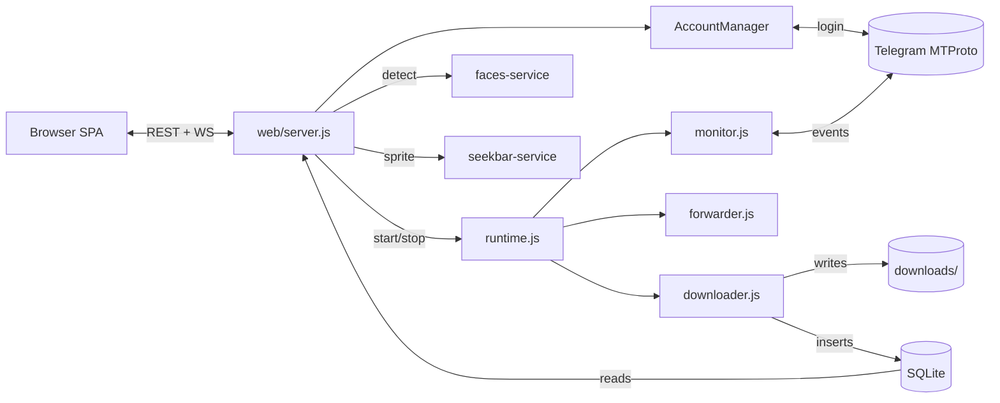

<p align="center">
  
  
  
  
  
</p>

<h1 align="center">Telegram Media Downloader</h1>

<p align="center">
  Self-hosted tool to download photos, videos, documents, voice messages, GIFs, stickers, and Stories<br>
  from any Telegram channel, group, or DM — including private ones. No bots, no quotas, no cloud.
</p>

<p align="center">
  <a href="#quick-start">Quick Start</a> &bull;
  <a href="#features">Features</a> &bull;
  <a href="#dashboard-preview">Dashboard</a> &bull;
  <a href="docs/CLUSTER.md">Cluster</a> &bull;
  <a href="docs/AI.md">AI Faces</a> &bull;
  <a href="docs/API.md">API</a> &bull;
  <a href="docs/DEPLOY.md">Deploy</a>
</p>

---

## Why this tool?

| Problem | Solution |
|---------|----------|
| Telegram bot API caps files at 50 MB / 4 GB | **User API (MTProto)** — no file size limits |
| No way to bulk-archive a channel | **One-click backfill** with date/count filters |
| Self-destructing media disappears | **TTL capture** — priority-queued before expiry |
| Private channels need special access | **Your account** can read it = this tool can download it |
| No easy way to share downloads | **Signed share links** — no login needed, revocable |
| Scattered across devices | **Web dashboard** — access from any browser on your network |

---

## Dashboard Preview

```
 ┌──────────────────────────────────────────────────────────────────────┐
 │  Telegram Media Downloader            [link] [stories] [search]  ⚙ │
 ├──────────────────────────────────────────────────────────────────────┤
 │  Monitor: ● Running     Queue: 3     Active: 2     Disk: 47.2 GB   │
 ├──────────┬───────────────────────────────────────────────────────────┤
 │          │                                                          │
 │ Gallery  │  ┌───────┐ ┌───────┐ ┌───────┐ ┌───────┐ ┌───────┐     │
 │ Queue    │  │ ▶ 1:23│ │       │ │ ▶ 0:45│ │       │ │ ▶ 3:10│     │
 │ Backfill │  │  img  │ │  img  │ │  img  │ │  img  │ │  img  │     │
 │ Settings │  └───────┘ └───────┘ └───────┘ └───────┘ └───────┘     │
 │ Maint.   │  ┌───────┐ ┌───────┐ ┌───────┐ ┌───────┐ ┌───────┐     │
 │  ├ Dupes │  │       │ │ ▶ 2:05│ │       │ │       │ │ ▶ 0:30│     │
 │  ├ NSFW  │  │  img  │ │  img  │ │  img  │ │  img  │ │  img  │     │
 │  ├ AI    │  └───────┘ └───────┘ └───────┘ └───────┘ └───────┘     │
 │  ├ Video │                                                          │
 │  └ Logs  │  Photos  Videos  Files  Audio        Grid ▪ Compact     │
 │          │                                                          │
 └──────────┴───────────────────────────────────────────────────────────┘
```

```
 ┌──────────────────────────────────────────────────────────────────────┐
 │  Queue                                          Speed: ████░ 12MB/s │
 ├──────────────────────────────────────────────────────────────────────┤
 │  ✓  vacation_photo_001.jpg     Tech News       1.2 MB   Done       │
 │  ↓  meeting_recording.mp4     Work Group      245 MB   ████▒ 67%  │
 │  ↓  presentation.pdf          Documents        8.4 MB   ██▒── 34%  │
 │  ◷  voice_message_042.ogg     Family Chat     340 KB   Queued      │
 │  ◷  sticker_pack.webp         Memes           128 KB   Queued      │
 │  ◷  annual_report.xlsx        Finance         2.1 MB   Queued      │
 └──────────────────────────────────────────────────────────────────────┘
```

```
 ┌──────────────────────────────────────────────────────────────────────┐
 │  AI Face Clustering — People                                        │
 ├──────────────────────────────────────────────────────────────────────┤
 │                                                                      │
 │   (•‿•)       (•‿•)       (•‿•)       (•‿•)       (•‿•)            │
 │   Alice       Bob         Carol       David       Unknown           │
 │   127 faces   84 faces    56 faces    43 faces    12 faces          │
 │   ▎▎ video    ▎▎ video                                              │
 │                                                                      │
 │  [All] [Unlabeled] [Video]            Model: buffalo_l  [Scan]      │
 └──────────────────────────────────────────────────────────────────────┘
```

---

## Quick Start

### Docker (recommended)

```bash
git clone https://github.com/botnick/telegram-media-downloader.git
cd telegram-media-downloader
docker compose up -d
```

Open `http://localhost:3000` and follow the setup wizard:

1. **Set password** (first run only)
2. **Settings > Telegram API** — paste `apiId` + `apiHash` from [my.telegram.org](https://my.telegram.org)
3. **Settings > Accounts > Add** — phone, OTP, optional 2FA
4. **Start monitor** — or paste a `t.me/` link to download a single message

### One-click cloud deploy

| Provider | |
|----------|---|
| **Render** | [](https://render.com/deploy?repo=https://github.com/botnick/telegram-media-downloader) |
| **Railway** | [](https://railway.app/template/?template=https://github.com/botnick/telegram-media-downloader) |

### Node.js (bare metal)

```bash
git clone https://github.com/botnick/telegram-media-downloader.git
cd telegram-media-downloader
npm ci && npm start
```

---

## Features

### Core Engine

- **Realtime monitor** — watches unlimited channels, groups, supergroups, and forum topics
- **Monitor resumes last state** — auto-starts on boot if it was running before shutdown
- **Bulk backfill** — archive thousands of past messages with date/count filters
- **Multi-account** — unlimited Telegram accounts with per-group routing
- **Dual-lane queue** — realtime downloads never starve behind backfill
- **TTL capture** — self-destructing media priority-queued before expiry
- **Smart dedup** — SHA-256 at download time + on-demand library scan
- **Auto-forward** — relay downloads to another chat or Saved Messages
- **Integrity sweep** — hourly scan re-queues missing files, prunes orphans
- **Disk rotation** — auto-prune oldest files when size limit exceeded

### Web Dashboard

- **Telegram-themed SPA** — responsive, installable PWA, works offline
- **Gallery** — grid/compact/list views, lazy-load thumbnails, type filters, search
- **Queue** — IDM-style per-file progress, pause/resume/cancel/retry
- **Video player** — scrub, seekbar hover preview, PiP, keyboard shortcuts
- **Share links** — HMAC-signed URLs with TTL, revocable, no login required
- **Bilingual** — English + Thai, runtime switchable

### AI & Media Intelligence

| Feature | Backend | Description |
|---------|---------|-------------|
| **Face clustering** | Python sidecar (insightface + DBSCAN) | Detect and group faces from photos and videos. GPU-accelerated. |
| **Seekbar previews** | Go sidecar (ffmpeg) | Netflix-style hover thumbnails on the video scrub bar |
| **NSFW detection** | In-process (HuggingFace WASM) | Local image classifier with review UI and whitelist |
| **Duplicate finder** | SHA-256 + GROUP BY | Full-library scan with bulk delete |

### Backup & Sync

- **5 backup providers** — S3 / R2 / B2 / Wasabi, SFTP, Google Drive, Dropbox, local mount
- **Client-side encryption** — optional AES-256-GCM per destination
- **Cluster mode** — federate multiple dashboards into one library with real-time sync, automatic failover, LAN auto-discovery

### Security

- **Fail-closed** — no password = no access
- **scrypt password hashing** with `timingSafeEqual` verification
- **httpOnly + sameSite=strict** session cookies
- **Default-deny API** — guest role is read-only, mutations are admin-only
- **Rate-limited login** — 10 attempts / 15 min / IP
- **Symlink/traversal proof** file serving via `fs.realpath`
- **CodeQL + Dependabot** scheduled scans

---

## Architecture



---

## Supported File Types

Photos (JPEG, PNG, WebP, BMP) / Videos (MP4, MKV, AVI, MOV, WebM) / Audio (MP3, M4A, FLAC, WAV, OGG, voice) / Documents (PDF, ZIP, any MIME) / GIFs / Stickers (WebP, TGS) / URL extraction

---

## Configuration

All config lives in SQLite (`kv['config']`), editable from the dashboard. Legacy JSON files are auto-imported on first boot.

<details>
<summary>Full config reference</summary>

```jsonc
{
  "telegram":   { "apiId": "...", "apiHash": "..." },
  "accounts":   [/* populated by wizard */],
  "groups":     [/* {id, name, enabled, filters, autoForward, monitorAccount} */],
  "monitor":    { "autoStart": true },
  "download":   { "concurrent": 5, "retries": 5, "maxSpeed": 0 },
  "rateLimits": { "requestsPerMinute": 15 },
  "diskManagement": { "maxTotalSize": "50GB" },
  "proxy":      { "type": "socks5", "host": "...", "port": 1080 },
  "advanced": {
    "ai":       { "enabled": false, "faces": { "detectorModel": "buffalo_l" } },
    "seekbar":  { "enabled": false, "autoOnDownload": false },
    "nsfw":     { "enabled": false, "threshold": 0.6 },
    "thumbs":   { "autoOnDownload": true }
  }
}
```

</details>

<details>
<summary>Environment variables</summary>

| Variable | Default | Description |
|----------|---------|-------------|
| `TGDL_PORT` | `3000` | Dashboard port |
| `TGDL_DATA_DIR` | `./data` | Base data directory |
| `TGDL_DOWNLOADS_DIR` | _(unset)_ | Split downloads onto separate disk |
| `TGDL_DEBUG` | _(unset)_ | `1` = verbose logging |
| `FFMPEG_HWACCEL` | _(empty)_ | `cuda` / `vaapi` / `qsv` / `videotoolbox` |
| `WATCHTOWER_HTTP_API_TOKEN` | _(unset)_ | Auto-update sidecar token |
| `FACES_SERVICE_URL` | `http://tgdl-faces:8011` | Face clustering sidecar |
| `SEEKBAR_SIDECAR_URL` | _(unset)_ | Seekbar sidecar URL |

Full env-var reference (27+ knobs) in [docs/AI.md](docs/AI.md).

</details>

---

## Docker Compose Profiles

```bash
# Base (dashboard + engine)
docker compose up -d

# + AI face clustering (CPU)
docker compose --profile faces up -d

# + AI face clustering (NVIDIA GPU)
docker compose --profile faces-cuda up -d

# + Auto-update via watchtower
docker compose --profile auto-update up -d

# Combine
docker compose --profile faces --profile auto-update up -d
```

---

## CLI Commands

| Command | Description |
|---------|-------------|
| `npm start` | Dashboard at `http://localhost:3000` |
| `npm run dev` | Dashboard with auto-restart on edits |
| `npm run monitor` | Headless realtime monitor (no UI) |
| `npm run history` | Bulk backfill from terminal |
| `npm run doctor` | Diagnostics (Node, SQLite, ffmpeg, sidecars) |
| `npm run auth` | Reset dashboard password |
| `npm test` | Run 5700+ vitest specs |

---

## File Layout

```
data/
├── db.sqlite               # config + downloads + faces + sessions (WAL mode)
├── secret.key              # BACK THIS UP — decrypts all sessions
├── sessions/<id>.enc       # AES-256-GCM encrypted Telegram sessions
├── downloads/<group>/      # organized by chat and media type
├── thumbs/                 # server-generated WebP thumbnails
├── seekbar/                # video sprite sheets + metadata
├── backups/                # pre-update DB snapshots
└── logs/                   # rotated at 5 MB
```

---

## FAQ

<details>
<summary><b>How is this different from a Telegram bot?</b></summary>

Bots use the Bot API with file-size caps (50 MB upload / 4 GB download). This tool uses the **User API (MTProto)** — it authenticates as your account and can access everything you see on your phone, including private channels.
</details>

<details>
<summary><b>Will my account get banned?</b></summary>

Built-in rate limiting (default 15 req/min) and FloodWait handling minimize risk. Don't lower limits aggressively or run dozens of accounts on one IP.
</details>

<details>
<summary><b>Can I download from private channels?</b></summary>

Yes. If your Telegram account is a member, this tool can download from it.
</details>

<details>
<summary><b>Can I download Stories?</b></summary>

Yes. Click the camera icon, enter a username, pick which Stories to save.
</details>

<details>
<summary><b>Can I capture self-destructing media?</b></summary>

Yes. TTL messages are detected and front-loaded in the queue before they expire.
</details>

<details>
<summary><b>How do I download a single message?</b></summary>

Paste the `t.me/...` URL into the dashboard's link drawer. Supports channel, group, forum-topic, and private links.
</details>

<details>
<summary><b>How does auto-update work?</b></summary>

Opt-in watchtower sidecar. Set `WATCHTOWER_HTTP_API_TOKEN` in `.env`, start with `--profile auto-update`. DB is snapshotted before every update. The dashboard never touches the Docker socket.
</details>

<details>
<summary><b>What platforms does it run on?</b></summary>

Windows, Linux, macOS, Raspberry Pi, Synology NAS, and Docker (amd64 + arm64).
</details>

---

## Documentation

| Document | Description |
|----------|-------------|
| [Architecture](docs/ARCHITECTURE.md) | System design deep-dive |
| [API Reference](docs/API.md) | HTTP + WebSocket endpoints |
| [Cluster Mode](docs/CLUSTER.md) | Multi-machine federated library |
| [AI Face Clustering](docs/AI.md) | insightface setup, GPU, models |
| [Backup Providers](docs/BACKUP.md) | S3, SFTP, GDrive, Dropbox |
| [Deploy](docs/DEPLOY.md) | Reverse proxy recipes (Caddy, nginx, Traefik) |
| [Troubleshooting](docs/TROUBLESHOOTING.md) | Common issues and fixes |

---

## Contributing

```bash
npm ci
npm run lint    # biome lint
npm test        # 5700+ vitest specs
```

See [CONTRIBUTING.md](CONTRIBUTING.md) for conventions.

---

## License

[MIT](LICENSE) — free for personal and commercial use.

Not affiliated with Telegram. Uses the public MTProto User API via [GramJS](https://github.com/gram-js/gramjs).

---

<p align="center">
  <b>Keywords:</b> Telegram downloader, Telegram channel scraper, Telegram media backup, download Telegram videos, download Telegram photos, Telegram archive tool, self-hosted Telegram, Telegram bulk download, Telegram private channel downloader, t.me link downloader, Telegram TTL downloader, Telegram Stories downloader, Telegram NSFW filter, Telegram cluster mode, Telegram face recognition, Telegram seekbar preview, Docker Telegram downloader, Raspberry Pi Telegram, NAS Telegram downloader, open-source Telegram tool
</p>
