<p align="center">
  <a href="https://github.com/botnick/telegram-media-downloader/releases/latest"></a>
  
  
  <a href="https://github.com/botnick/telegram-media-downloader/pkgs/container/telegram-media-downloader"></a>
  <a href="https://github.com/botnick/telegram-media-downloader/actions/workflows/ci.yml"></a>
</p>

<h1 align="center">Telegram Media Downloader</h1>

<p align="center">
  <b>Self-hosted Telegram media downloader with a web dashboard.</b><br>
  Download and archive photos, videos, files, voice messages and Stories from Telegram channels, groups and chats<br>
  you belong to, with your own account. One Go binary or Docker image. No bot, no cloud.
</p>

<p align="center">
  <a href="#quick-start">Quick start</a> &bull;
  <a href="#features">Features</a> &bull;
  <a href="#dashboard">Dashboard</a> &bull;
  <a href="#faq">FAQ</a> &bull;
  <a href="https://botnick.github.io/telegram-media-downloader/">Website</a> &bull;
  <a href="docs/README.md">Docs</a>
</p>

> **3.0 is a native Go server.** Node.js is gone: one `tgdl-server` binary
> (or the Docker image) runs everything. 2.x installs upgrade in place with the
> same image, port, data folder and logins. See
> [Upgrading from 2.x](docs/UPGRADING.md).

<p align="center">
  <picture>
    <source media="(prefers-color-scheme: light)" srcset="docs/screenshots/library-light.webp">
    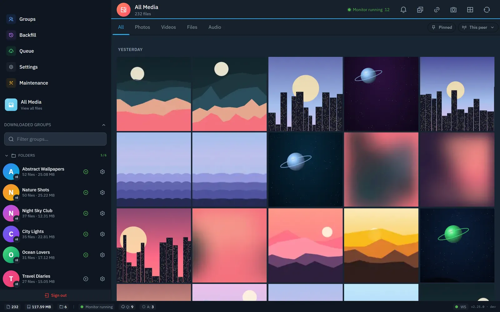
  </picture>
</p>

## Why this tool?

| Problem | What it does |
|---------|--------------|
| Bots only see chats they were added to, with file-size limits | Signs in as **your account** over MTProto: if you can read it, it can save it |
| No easy way to archive a whole channel | **History backfill** that survives restarts, plus a **realtime monitor** |
| The same video forwarded everywhere | **Skips duplicates before downloading**, then confirms by SHA-256 |
| Files scattered across devices | **Web dashboard and PWA** on any browser in your network |
| Sharing a file with someone without an account | **Signed, expiring share links** you can revoke |
| Keeping a copy somewhere else | **Backups** to a local disk, S3, SFTP or FTP/FTPS, optionally encrypted |

## Quick start

You need a Telegram `apiId` and `apiHash` from [my.telegram.org](https://my.telegram.org).

### Docker (recommended)

```bash
mkdir telegram-media-downloader && cd telegram-media-downloader
mkdir -p data
curl -fsSLO https://raw.githubusercontent.com/botnick/telegram-media-downloader/main/docker-compose.yml
docker compose up -d
```

Set the first dashboard password from a private file containing one line
(at least 8 characters), then delete the file:

```bash
docker compose exec -T -u node telegram-downloader tgdl-server setup --password-stdin < /path/to/password-file
```

Open `http://localhost:3000` and:

1. **Sign in** with that password.
2. **Settings → Telegram API**: paste `apiId` and `apiHash`.
3. **Settings → Accounts → Add**: phone, login code, optional 2FA.
4. **Chats**: turn on the monitor, start a backfill, or paste a `t.me/` link.

The image is multi-arch (amd64, arm64). Synology users can start from
[`docker-compose.synology.yml`](docker-compose.synology.yml).

### Native binary (no Docker)

Download `tgdl-server-v<version>-<os>-<arch>.tar.gz` for Linux, Windows or
macOS from the [latest release](https://github.com/botnick/telegram-media-downloader/releases/latest),
then:

```bash
tar -xzf tgdl-server-v*-linux-amd64.tar.gz
TGDL_DATA_DIR=./data ./tgdl-server
```

On the same machine, `http://localhost:3000` shows the setup form for the
first password. Install ffmpeg for thumbnails.

Prefer a git checkout? `./runner.sh` (Windows: `run_safe.bat`) downloads and
verifies the matching release for you. Details, systemd and reverse-proxy
examples: [Install and deploy](docs/DEPLOY.md).

## Features

**Downloading**
- Realtime monitor for channels, groups, forum topics and private chats, with
  per-chat media-type, sender and topic filters
- History backfill (pull older, catch up, rescan) that resumes after a restart
- `t.me/` message links and Telegram Stories
- Several Telegram accounts; pin each chat to the account that reads it
- SOCKS5, SOCKS4, HTTP and MTProxy proxies
- 1–50 parallel downloads, retries and a live bandwidth limit
- Rescue mode: keep only media whose source message was deleted

**Library**
- Duplicates skipped by Telegram media identity, confirmed by SHA-256, plus a
  duplicate finder with bulk delete
- Gallery with thumbnails, search, pins, bulk delete and ZIP download
- Video player with MP4 faststart; signed, expiring share links
- Separate tab for deleted or inaccessible chats; leave dead chats in bulk
- Installable PWA, dark and light theme, English and Thai

**Operations**
- One-click update from the dashboard (Docker + bundled watchtower), with a
  verified database snapshot first
- Backups to local disk, S3-compatible storage, SFTP and FTP/FTPS, with
  encrypted archives and offline restore
- Cluster mode: pair instances and browse each other's files
- Database integrity, vacuum, file verification and recovery tools

**Security**
- Fail-closed: nothing is reachable until a password is set
- scrypt password hashes, `HttpOnly` + `SameSite=Strict` cookies revoked on
  the server, login limited to 10 attempts per 15 minutes
- Read-only guest password; Telegram sessions encrypted at rest
- CSP and security headers; `TRUST_PROXY` for reverse proxies

**Not in 3.0 yet:** Google Drive and Dropbox backups, hardware-accelerated
thumbnails (`FFMPEG_HWACCEL` is ignored), new face/NSFW/seekbar AI results,
auto-forward, self-destructing media capture and automatic disk rotation. See
[Features](docs/FEATURES.md#not-in-30).

## Dashboard

<table>
  <tr>
    <td width="50%">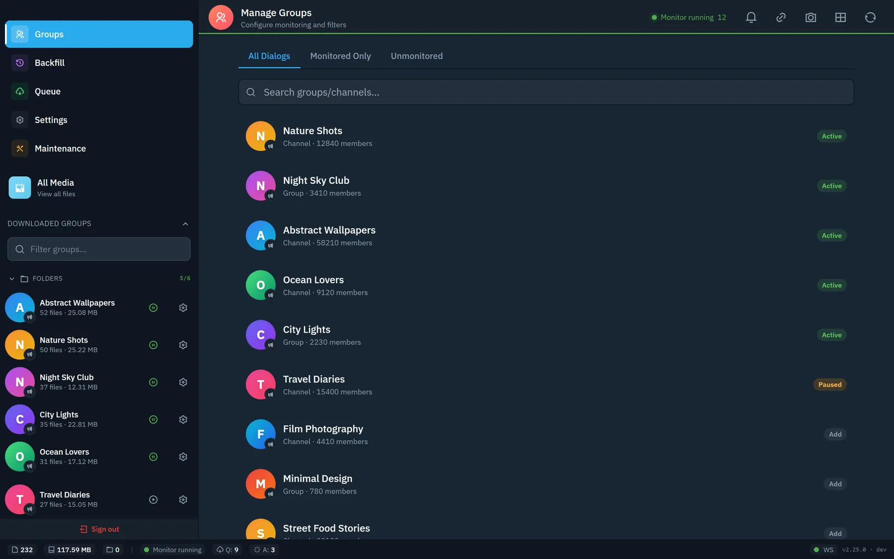</td>
    <td width="50%">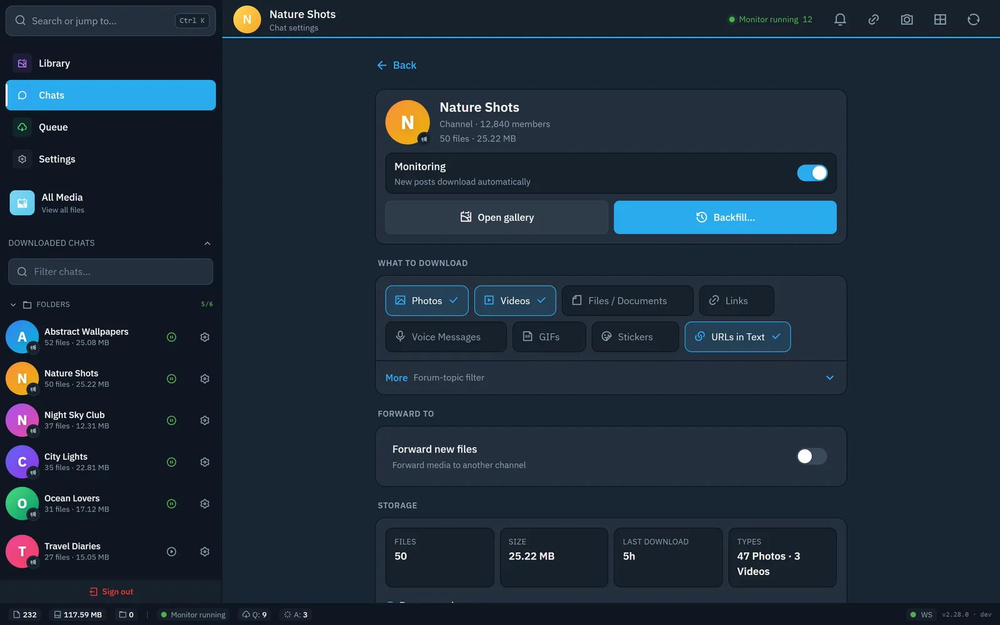</td>
  </tr>
  <tr>
    <td align="center"><b>Chats</b> — monitor channels, groups and DMs; backfill history</td>
    <td align="center"><b>Chat details</b> — what to download and storage, in one page</td>
  </tr>
  <tr>
    <td>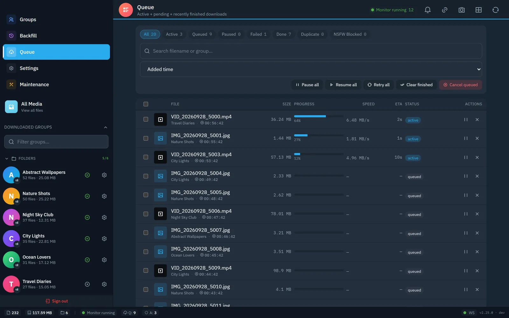</td>
    <td>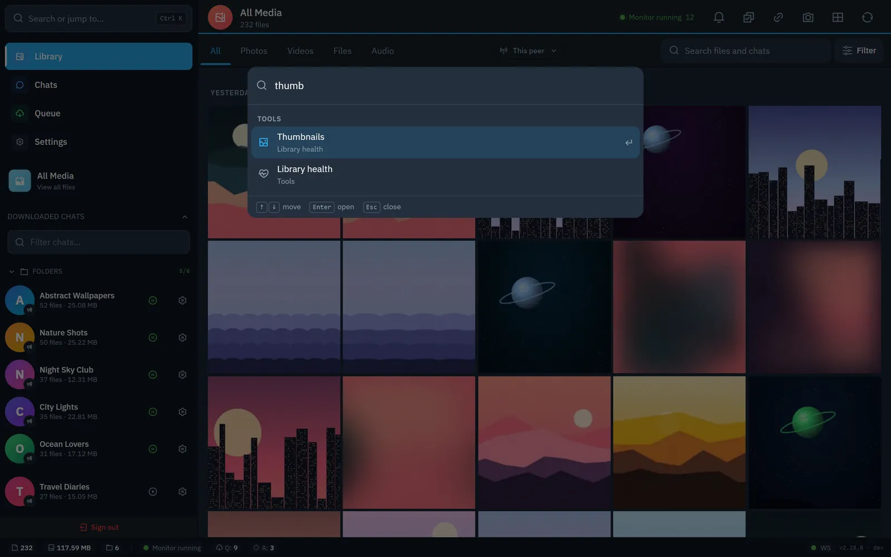</td>
  </tr>
  <tr>
    <td align="center"><b>Queue</b> — live progress, speed, ETA; pause, retry or cancel any file</td>
    <td align="center"><b>Ctrl+K</b> — jump to any page, tool, setting or chat</td>
  </tr>
  <tr>
    <td>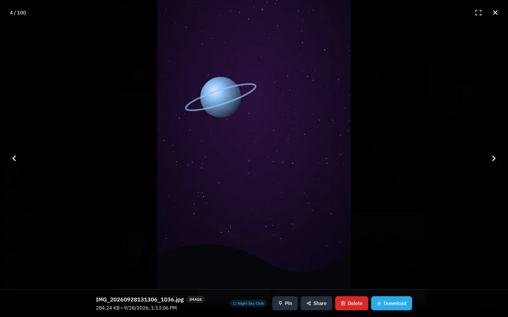</td>
    <td>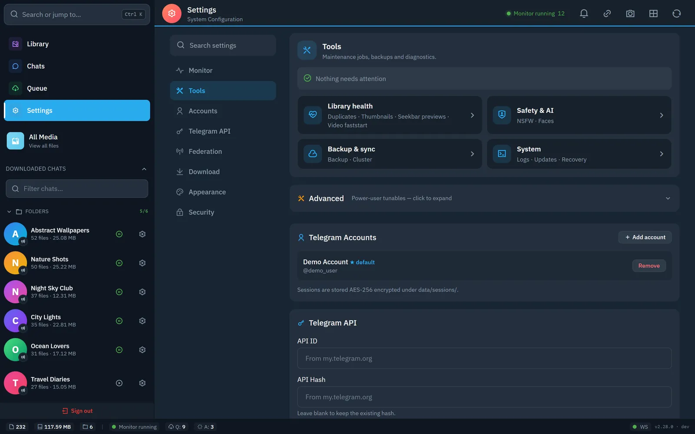</td>
  </tr>
  <tr>
    <td align="center"><b>Viewer</b> — swipe / arrow keys, pin, share link, download</td>
    <td align="center"><b>Tools</b> — duplicates, thumbnails, backups, cluster, maintenance</td>
  </tr>
</table>

<p align="center">
  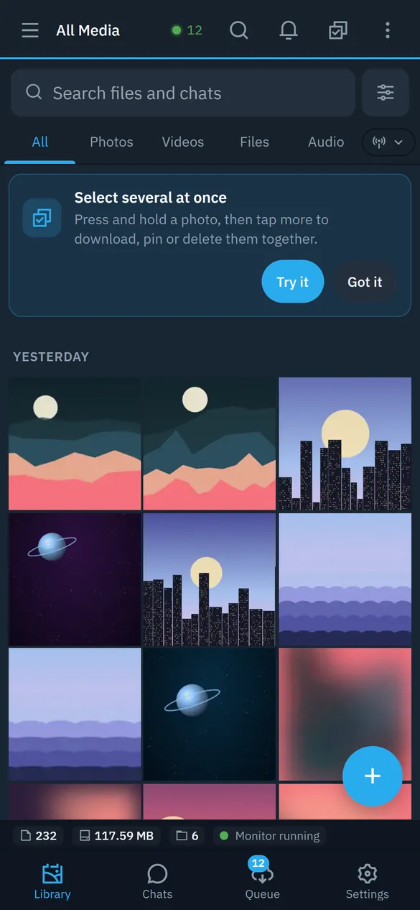
  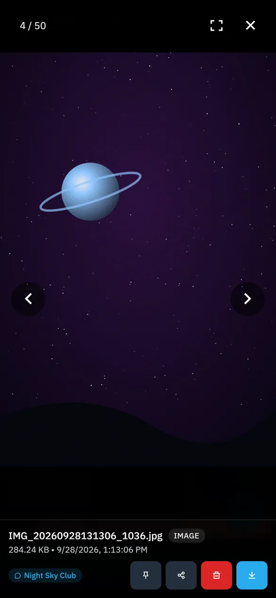
  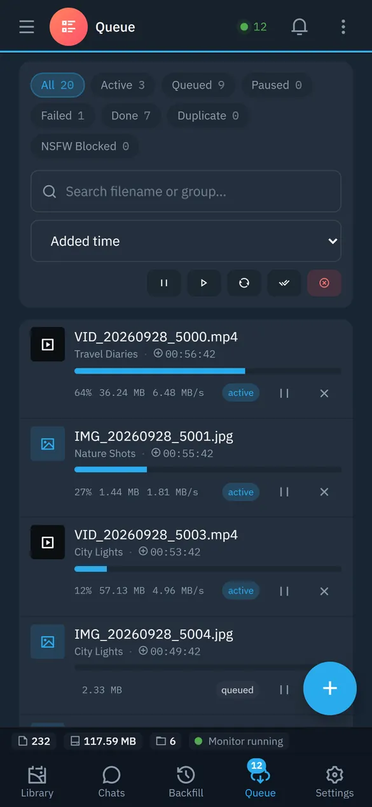
  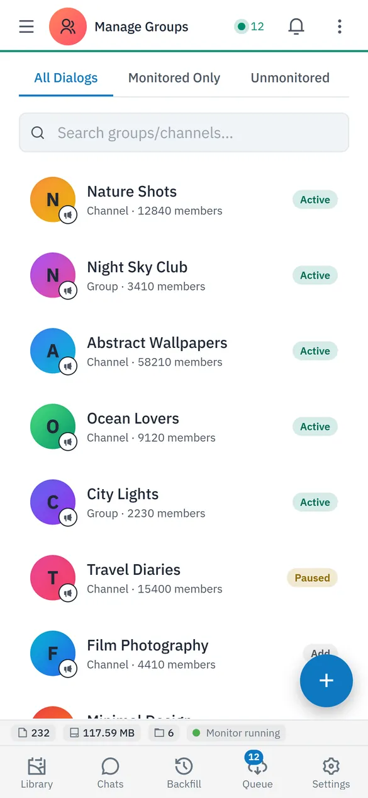
</p>
<p align="center"><sub>The same dashboard on a phone, in dark or light theme. Screenshots use generated demo images and fictional chat names.</sub></p>

## How it works

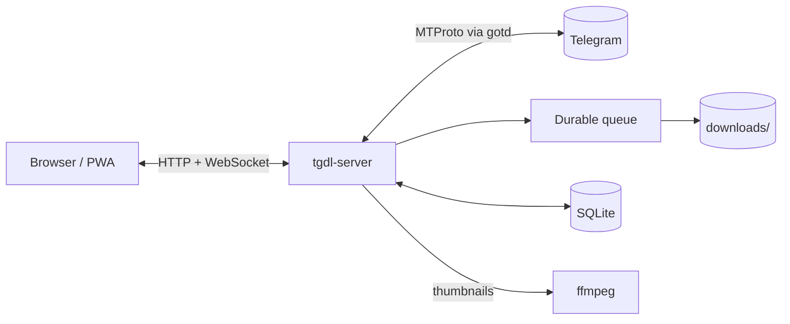
```mermaid
flowchart LR
    browser[Browser / PWA] <-- HTTP + WebSocket --> server[tgdl-server]
    server <-- MTProto via gotd --> telegram[(Telegram)]
    server --> queue[Durable queue]
    queue --> files[(downloads/)]
    server <--> db[(SQLite)]
    server -- thumbnails --> ffmpeg[ffmpeg]
```

`tgdl-server` is a single Go program. It serves the embedded dashboard, owns
the SQLite database and the Telegram connections, and runs downloads, dedup,
backups and maintenance. Downloads are written to a `.part` file and published
atomically, so an interrupted transfer never leaves a half file in the library.
More in [Architecture](docs/ARCHITECTURE.md).

## Updating

- **In the dashboard (Docker):** Settings → Maintenance → **Install update**.
- **Automatically (Docker):** `WATCHTOWER_HTTP_API_PERIODIC_POLLS=true` in `.env` updates all containers on a schedule (default daily 04:00).
- **Docker, by hand:** `docker compose pull && docker compose up -d`
- **Native:** replace the binary, or `git pull` and restart `./runner.sh`.

Migrations run automatically. Coming from 2.x: nothing to change, see
[Upgrading from 2.x](docs/UPGRADING.md).

## Configuration

Settings live in the dashboard and are stored in SQLite. Environment
variables cover start-up only:

| Variable | Default | Purpose |
|----------|---------|---------|
| `TGDL_PORT` | `3000` | Host port in `docker-compose.yml` |
| `TGDL_DATA_DIR` | `/app/data` (Docker), `./data` (launchers) | Data folder (required for a bare binary) |
| `TGDL_DOWNLOADS_DIR` | `<data>/downloads` | Keep media on another disk |
| `TRUST_PROXY` | `1` in Compose | Reverse-proxy trust |
| `TGDL_SECURE_COOKIES` | `0` | Set `1` behind HTTPS |
| `TGDL_BIND_HOST` | all interfaces | Listen address, e.g. `127.0.0.1` |

Full list: [Configuration](docs/CONFIGURATION.md).

```text
data/
├── db.sqlite          # settings, catalog, jobs, sessions
├── secret.key         # BACK THIS UP: decrypts the Telegram sessions
├── sessions/native/   # encrypted Telegram logins
├── downloads/<chat>/  # your media
├── thumbs/            # generated thumbnails
└── backups/           # database snapshots (incl. pre-update)
```

## FAQ

### How do I download all media from a Telegram channel?

Add your Telegram account (Settings → Accounts), open **Chats**, pick the
channel and start a **backfill**. Choose how many messages to read, or 0 for
all of them. The queue shows each file with progress, speed and ETA. Turn on
the realtime monitor for that chat to keep the archive current.

### Can it download from private channels and groups?

Yes, if the Telegram account you sign in with is a member. The tool acts as
that account over the Telegram user API (MTProto), so it reads what you can
read in the Telegram app.

### How is this different from a Telegram bot?

Bots use the Bot API, which limits file sizes and only sees chats the bot was
added to. This tool logs in as your user account through MTProto, so it has no
bot-style file-size cap and sees your own chats.

### Is my Telegram session safe?

Sessions are encrypted at rest in `data/sessions/`, with the key in
`data/secret.key`. Nothing is sent to a service run by this project. The
dashboard fails closed: without a password nobody gets in. Put it behind HTTPS
if you expose it, and back up `secret.key`. See [SECURITY.md](SECURITY.md).

### Will my account get banned?

It uses the normal user API like a Telegram app, but heavy automated
downloading always carries some risk. Failed downloads retry with growing
delays; keep parallel downloads and the bandwidth limit moderate, and avoid
running many accounts from one IP. No tool can promise zero risk.

### Does it run on a Raspberry Pi or a Synology NAS?

Yes. The Docker image is built for amd64 and arm64, and release binaries also
cover 32-bit ARM (`linux-arm`). Synology has its own compose file. See
[Install and deploy](docs/DEPLOY.md).

### Can I download Stories or single messages?

Yes. Look up a user's Stories by username and pick what to save, or paste
`t.me/...` message links (channel, group, forum topic and private links).

### Do I need Node.js?

No. Since 3.0 the server is a single Go binary. `npm start` and PM2 still work
for old setups; they only call the launcher, which downloads that binary.

### Where are the files stored, and can I back them up?

Under `data/downloads/<chat>/`, or `TGDL_DOWNLOADS_DIR` on another disk.
Backups go to a local folder, S3-compatible storage (AWS, R2, B2, Wasabi,
MinIO), SFTP or FTP/FTPS, with optional encryption and an offline restore
command. Google Drive and Dropbox are not available in 3.0. See
[Backup](docs/BACKUP.md).

## Documentation

| Page | Contents |
|------|----------|
| [Install and deploy](docs/DEPLOY.md) | Docker, release binaries, systemd, reverse proxy, updating |
| [Upgrading from 2.x](docs/UPGRADING.md) | What carries over, what changed, rolling back |
| [Configuration](docs/CONFIGURATION.md) | Dashboard settings, environment variables, data folder |
| [Features](docs/FEATURES.md) | Everything 3.0 does and what is not in 3.0 yet |
| [Backup](docs/BACKUP.md) | Local, S3, SFTP, FTP/FTPS, encryption, restore |
| [Cluster mode](docs/CLUSTER.md) | Pairing several instances |
| [AI: faces, NSFW and previews](docs/AI.md) | What remains of the AI tools in 3.0 |
| [API reference](docs/API.md) | HTTP and WebSocket endpoints |
| [Troubleshooting](docs/TROUBLESHOOTING.md) | Common problems and fixes |
| [Architecture](docs/ARCHITECTURE.md) | How the server is built |
| [Changelog](CHANGELOG.md) | Release notes |

The docs are also published as a searchable site at
[botnick.github.io/telegram-media-downloader](https://botnick.github.io/telegram-media-downloader/),
and [`llms.txt`](llms.txt) gives AI assistants a curated index.

## Contributing

```bash
make build   # core-service/tgdl-server
make test    # Go tests
make check   # gofmt, go vet, race tests
```

See [CONTRIBUTING.md](CONTRIBUTING.md).

## License

[MIT](LICENSE). Not affiliated with Telegram. Uses the MTProto user API via
[gotd](https://gotd.dev/).
