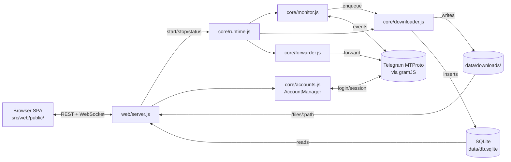

# Architecture

Two top-level entry points share state through `data/`:

1. **CLI** (`src/index.js`) — interactive menus, ad-hoc commands.
2. **Web server** (`src/web/server.js`) — Express + WebSocket on `:3000`, serves the SPA from `src/web/public/`.

Both share state through `data/db.sqlite` (WAL mode → safe shared reads, single writer). Every runtime state surface — settings, account list, group filters, session tokens, disk-usage cache, recent-backfills history, queue-history snapshots, the spillover queue, and the auto-update audit log — lives in SQLite tables. There is **no JSON state file in normal operation**. Legacy installs upgrading from pre-v2.8 carry `data/config.json` / `data/disk_usage.json` / `data/web-sessions.json` / `data/history-jobs.json` / `data/queue-history.json` / `data/logs/queue_backlog.jsonl` — all auto-imported on first boot and renamed to `*.migrated` as a reversible backup.

## Request flow



## Data layout (gitignored)

```
data/
├── db.sqlite             # downloads, queue, share_links, kv, web_sessions,
│                          queue_backlog, update_history, faces, people,
│                          seekbar_sprites, backup_destinations / backup_jobs,
│                          peer_*, cluster_audit — WAL mode
│                          (kv holds config + disk_usage + history_jobs +
│                          queue_history; deep-merged on load)
├── secret.key            # AES key for sessions; back this up
├── sessions/<id>.enc     # per-account scrypt+AES-GCM encrypted sessions
├── photos/<id>.jpg       # cached chat profile photos
├── downloads/            # canonical media tree
│   └── <sanitised-group-name>/
│       ├── images/  videos/  documents/  audio/  stickers/
├── thumbs/<sha>.webp     # server-generated WebP thumbnails (cache)
├── seekbar/<id>.webp     # video timeline sprite sheets + <id>.json sidecars
├── faces-service/        # auto-downloaded Python sidecar binary + buffalo_l model cache
├── models/               # NSFW model cache (only when the feature is enabled)
├── backups/              # pre-update DB snapshots (last 5 kept, verified)
└── logs/
    ├── network.log       # noise-classified gramJS chatter
    └── protection_log.txt
```

**State storage.** Every runtime surface is SQLite-backed:

| Surface | Source of truth | Replaces |
|---|---|---|
| `kv['config']` | `src/config/manager.js` (`loadConfig` / `saveConfig`) | `data/config.json` |
| `kv['disk_usage']` | `src/core/downloader.js` + `src/web/server.js` (`writeDiskUsageCache`) | `data/disk_usage.json` |
| `kv['history_jobs']` | `src/web/server.js` (`loadHistoryJobsFromStore` / `saveHistoryJobsToStore`) | `data/history-jobs.json` |
| `kv['queue_history']` | `src/web/server.js` (`pushQueueHistory` / `flushQueueHistorySoon`) | `data/queue-history.json` |
| `web_sessions` table | `src/core/web-auth.js` + `src/core/db.js` accessors | `data/web-sessions.json` |
| `queue_backlog` table | `src/core/db.js` (`pushQueueBacklog` / `popQueueBacklog`) + `src/core/downloader.js` spillover | `data/logs/queue_backlog.jsonl` |
| `update_history` table | `src/core/db.js` (`recordUpdateAttempt` / `recordUpdateFailure` / `finaliseSuccessfulTrigger` / `finalisePendingUpdates`) | (new in v2.8, hardened in v2.10) |
| `peers` + `peer_*` tables | `src/core/cluster/peers.js` + `src/core/cluster/sync.js` | (new in v2.10) |
| `cluster_audit` table | `src/core/cluster/audit.js` | (new in v2.10) |
| `faces` + `people` tables | `src/core/ai/faces.js` + `src/core/db.js` | (new in v2.16) |
| `seekbar_sprites` table | `src/core/seekbar/generator.js` + `src/core/db.js` | (new in v2.17) |

`saveConfig()` emits a `change` event on an in-process `EventEmitter` after every commit — `monitor.js` subscribes via `watchConfig()` and reloads without any filesystem watcher. Migration from JSON files is one-shot, idempotent, and runs inside `getDb()`; source files are renamed to `*.migrated` and kept as a reversible backup. The auto-update audit table is finalised on every container boot — any `triggered` row whose `from_version` *or* `from_instance_id` differs from the running container is promoted to `success`, capturing the actual transition observed (the `from_instance_id` column was added in v2.10 to handle `:latest`-tag rebuilds where semver is unchanged).

## Multi-account routing

`AccountManager` (`src/core/accounts.js`) holds `Map<accountId, TelegramClient>`. Each `.enc` session file under `data/sessions/` becomes one connected client.

When `RealtimeMonitor.start()` runs, it walks every enabled group and asks each loaded client whether it can read it (`getMessages(groupId, {limit:1})`); the first one that succeeds is cached in `groupClientCache`. A group can pin an explicit account via `group.monitorAccount` — that wins.

Pin resolution self-heals. `getClientForGroup` only honours `monitorAccount` when that id is still in `clients`; a dead pin (account deleted + re-added under a new id) is skipped and the group falls through to the probe sweep across every connected client. On the first successful probe the winning account is written back to `group.monitorAccount`, so the group "remembers" a working account without manual reassignment. The same pin-first-then-sweep + re-pin logic backs the history backfill path. Removing an account clears any `group.monitorAccount` that referenced it (leaving pins to other accounts untouched), and the web add/delete routes hot-reload the AccountManager + restart the engine through `runtime.restart` so live clients repopulate without a process restart.

`AccountManager._keepAliveTick()` pings every loaded client to extend Telegram's idle-disconnect window, and reconnects any client it finds with a dropped socket (`connected === false`) before pinging — without it a single idle-disconnect or network blip would leave a client dead until the next process restart, surfacing as `not_connected` on `/api/dialogs` and `NO_ACCESS` on backfill.

When editing monitor / forwarder / history code, never assume `this.client` is the right client for a given group — go through `getClientForGroup(group)`.

## Web auth

Auth is opaque sessions, not passwords:

1. CLI or web setup hashes the password with **scrypt** (per-password random salt) and stores it as `config.web.passwordHash = {algo:'scrypt', salt, hash, …}`.
2. Login posts the password, server tries the admin hash first then the optional `guestPasswordHash`, verifies via `crypto.timingSafeEqual`, and issues a 64-char hex token persisted to the `web_sessions` table along with the resolved role.
3. The token is sent back as cookie `tg_dl_session` with `httpOnly`, `sameSite=strict`, and `secure` in production.
4. Every API call (and the WebSocket upgrade) re-validates the token with `validateSession(token)` and sets `req.role` for downstream middleware.

A default-deny chokepoint mounted right after `checkAuth` allowlists only the read-only routes that guests are allowed to hit (`/api/downloads*`, `/api/stats`, `/api/groups` GET, `/api/monitor/status`, `/api/queue/snapshot`, `/api/history*` GET, `/api/thumbs/*`, `POST /api/logout`); every mutation route returns `403 {adminRequired:true}` for guest sessions by construction. New mutation endpoints are admin-gated for free.

If no auth is configured the dashboard **fails closed** — `/setup-needed.html` walks first-time users through setting a password (only allowed from `127.0.0.1`).

## Share-link route

`GET /share/<linkId>?exp=<epoch>&sig=<base64url>` is registered BEFORE `checkAuth` and listed in `PUBLIC_PATH_PREFIXES`. Three independent gates protect it:

1. Per-IP rate limiter (configurable via `advanced.share.rateLimit{Window,Max}`).
2. HMAC-SHA256 signature check via `crypto.timingSafeEqual` (length-checked first).
3. DB row in `share_links` — must exist, not be revoked, and either have `expires_at = 0` (the "never expires" sentinel) or `expires_at > now()`.

All failure modes return 401 with a body `code` (`bad_sig` / `revoked` / `expired`) so an external scanner can't enumerate which link IDs exist.

## Engine queue

`Downloader` runs N workers (1–20, auto-scaled). The queue is split:

- `_high[]` — realtime (priority 1) and TTL/self-destruct (priority 0, unshifted to the front).
- `queue[]` — history backfill (priority 2). Spills to the `queue_backlog` SQLite table past 2000 entries (atomic appends, FIFO-by-id pops in one transaction — can't double-deliver after a crash mid-rehydrate).

Workers always drain `_high` first, then `queue`, then rehydrate from the backlog table. Realtime never starves behind backfill.

## Logger noise classifier

gramJS surfaces a steady stream of recoverable internals during reconnects (`TIMEOUT`, `Not connected`, `Connection closed`, `Reconnect`, `CHANNEL_INVALID`). The previous codebase silently dropped these via a global `console.error` filter that also swallowed real errors with the same words.

`src/core/logger.js` now classifies: noise still gets logged to `data/logs/network.log` but is only echoed to stderr when `TGDL_DEBUG=1` (or `DEBUG`). Real errors go through unchanged.

## SPA modules

```
src/web/public/js/
├── app.js            # router + init, group/dialog rendering, gallery grid
├── api.js            # fetch wrapper (401 → /login, 503 → /setup, 403 → toast)
├── ws.js             # WebSocket client with auto-reconnect
├── store.js          # state container (carries `role` + `selected`)
├── router.js         # hash router with admin-route redirect for guest sessions
├── settings.js       # Settings page + accounts + proxy + security + maintenance
├── nsfw-ui.js        # NSFW review sheet (lazy-loaded from settings.js)
├── share.js          # Share-link sheet (lazy-loaded from viewer + settings)
├── gallery-select.js # Drag-to-select lasso + ctrl/shift gestures + keyboard
├── viewer.js         # full-screen media viewer (seekbar sprite hover preview)
├── maintenance-thumbs.js / maintenance-seekbar.js / maintenance-ai.js / maintenance-nsfw.js / maintenance-video.js / maintenance-duplicates.js / maintenance-logs.js / maintenance-hub.js
├── queue.js          # IDM-style queue page (append-on-scroll, in-place patch)
├── backfill.js       # Backfill page (active jobs + recent + start)
├── engine.js         # Engine card (start/stop/status)
├── statusbar.js      # sticky footer + version chip + update chooser sheet
├── theme.js          # light/dark/auto toggle
├── fonts.js          # font registry + boot-time preloader
├── notifications.js  # opt-in browser toasts
├── monitor-status.js # shared monitor-status subscription (single fetch, many subscribers)
├── i18n.js           # data-i18n helper + lockstep en/th
├── sheet.js          # themed bottom-sheet replacement for native dialogs
└── utils.js          # formatters + escapeHtml + showToast
```

The SPA is vanilla ES Modules served over HTTP — no bundler, no build step. Asset URLs are cache-busted via `?v=<APP_VERSION>` so a fresh deploy is picked up immediately while unchanged versions stay cached as `immutable`.

## Backend modules

```
src/core/
├── accounts.js       # AccountManager — multi-account routing
├── monitor.js        # RealtimeMonitor — gramJS event handler + polling fallback
├── downloader.js     # DownloadManager — queue + workers + atomic writes
├── history.js        # HistoryDownloader — backfill with smart-resume modes
├── forwarder.js      # AutoForwarder — post-download forward to destination
├── checksum.js       # Canonical SHA-256 helper (used by downloader + dedup)
├── dedup.js          # On-demand library-wide duplicate scan
├── thumbs.js         # WebP thumbnail generator (sharp + ffmpeg fallback)
├── nsfw.js           # NSFW classifier (WASM, Falconsai/nsfw_image_detection)
├── share.js          # HMAC-SHA256 share-link sign/verify + secret bootstrap
├── updater.js        # Watchtower client + pre-flight ping + DB integrity check + verified snapshot
├── web-auth.js       # scrypt password hashing + role-aware sessions
├── db.js             # SQLite schema + migrations + helpers
├── runtime.js        # Engine lifecycle (monitor + downloader + forwarder)
├── disk-rotator.js   # Auto-prune oldest downloads when over quota
├── integrity.js      # Hourly file-existence sweep
├── rescue.js         # Rescue-mode sweeper (TTL-based prune)
├── stories.js        # Stories list + download adapters
├── url-resolver.js   # t.me / tg:// URL parsing
├── security.js       # RateLimiter + SecureSession (AES-256-GCM)
├── secret.js         # data/secret.key bootstrap
├── metrics.js        # OpenMetrics text format for Prometheus
├── job-tracker.js    # Single-flight + WS broadcast lifecycle for fire-and-forget admin jobs
├── ai/               # Face clustering subsystem (v2.16+, opt-in)
│   ├── index.js      # Public surface — pregenerateAi() hook, build/cancel, JobTracker drain
│   ├── faces.js      # DBSCAN clustering + label preservation
│   ├── faces-client.js  # HTTP client to the Python sidecar
│   ├── faces-config.js  # kv-config + TGDL_FACES_* env-var precedence
│   ├── faces-spawn.js   # Binary auto-download / Python fallback / Docker passthrough
│   └── scan-runner.js   # Phase A (detect + embed) over downloads.iterate
├── seekbar/          # Video timeline preview subsystem (v2.17+, opt-in)
│   ├── index.js      # pregenerateSeekbar() hook, build/purge, cache stats
│   ├── generator.js  # Per-row sprite + sidecar generator (Go sidecar client)
│   ├── client.js     # HTTP client to the Go sidecar
│   ├── spawn.js      # Auto-spawn the Go binary on a random localhost port
│   └── scan-runner.js  # Keyset-paged backfill scan (no cursor across awaits)
├── cluster/          # v2.10 federation layer
│   ├── identity.js   # peer_id, peer_name, cluster_token, pairing codes
│   ├── peers.js      # CRUD + status tracking
│   ├── handshake.js  # Pair initiator + acceptor
│   ├── hmac.js       # Per-pair-secret HMAC sign/verify
│   ├── sync.js       # Delta-sync paired catalogs over HTTP + WS push
│   ├── ws.js         # Persistent /ws/cluster channel
│   ├── dedup.js      # Cross-cluster hash lookup
│   ├── sweep.js      # Cross-peer dedup conflict resolver
│   ├── relay.js      # Forward signed calls through a relay peer
│   ├── failover.js   # Backup-peer takeover after grace period
│   ├── discovery.js  # UDP LAN auto-discovery (port 28910)
│   ├── config-sync.js # Per-key replication policy
│   ├── search.js     # Cluster-wide gallery search
│   ├── audit.js      # cluster_audit log
│   └── router.js     # isLocalGroup() — owner-peer routing helpers
└── logger.js         # noise classifier + WAL'd network log
```

## Out-of-process sidecars (v2.16+)

Two optional sidecars run beside the Node app. Both are off by default; each is gated by a `config.advanced.*.enabled` flag and spawned by Node on first use.

| Sidecar | Language | Source tree | Released as | Spawn module | Purpose |
|---|---|---|---|---|---|
| **`tgdl-faces`** | Python (FastAPI + insightface) | `faces-service/` | `ghcr.io/botnick/tgdl-faces:<tag>` + per-platform PyInstaller binaries | `src/core/ai/faces-spawn.js` | Face detection + 512-dim ArcFace embeddings (`buffalo_l`). Multi-platform GPU acceleration (DirectML / CUDA / OpenVINO / CoreML / CPU). |
| **`tgdl-seekbar`** | Go (stdlib HTTP + ffmpeg) | `seekbar-service/` | `ghcr.io/botnick/tgdl-seekbar:<tag>` + per-platform Go binaries | `src/core/seekbar/spawn.js` | WebP sprite-sheet timeline preview generation for the video player. |

Spawn order on each:

1. Honour an operator override URL (`TGDL_FACES_SIDECAR_URL` / `SEEKBAR_SIDECAR_URL`) — useful when running the sidecar in Docker compose under a fixed hostname.
2. Otherwise look for a locally cached binary under `data/<service>/bin/` and launch it on a random high port with a freshly minted HMAC token. The token is held in process memory only — never written to disk.
3. Auto-download the matching prebuilt binary from the GitHub release on first miss (gated by `TGDL_FACES_AUTO_DOWNLOAD` / `SEEKBAR_AUTO_DOWNLOAD`).
4. For faces only: fall back to `python -m tgdl_faces` when the host has Python ≥3.10 and the package is `pip install`ed.

The dashboard polls each sidecar's `/health` every 60 s; three consecutive failures triggers a respawn. Status transitions broadcast as `ai_faces_status` / `seekbar_sidecar_status` so the Maintenance pages can paint live pills without polling.

## Fire-and-forget admin jobs (`JobTracker`)

Every long-running admin action (verify files, db vacuum, dedup scan, thumbnail build, faststart sweep, NSFW scan, cluster sweep, etc.) follows one shared lifecycle in v2.10+:

- `POST` returns 200 in <500 ms with `{started:true}`.
- Work runs in the background via `JobTracker.tryStart(runFn)`.
- Progress streams over WebSocket as `${prefix}_progress`.
- Final result lands as `${prefix}_done` (with `result` merged in, or `error` on failure).
- A sibling `GET …/status` lets a re-mounted page recover live state.
- Concurrent calls return 409 with `code: 'ALREADY_RUNNING'` + the running snapshot.
- `kvSet('<feature>_last_run', summary)` inside the runFn persists a small last-run blob so dashboards survive server restart.

The race-condition family the v2.8.x routes had — broadcast `${prefix}_done` with the error inside the catch, then reset `_running = false` in finally — is structurally impossible in `JobTracker` because both happen inside the same `finally`. v2.10 migrated `dedup/scan`, `thumbs/build-all`, `faststart/scan`, and `reindex` over.

## Cluster mode (v2.10)

Optional federation across two or more dashboards. Each peer keeps its own DB and `data/downloads/` tree; the dashboard merges every paired peer's catalog into one gallery, with a small peer-source badge per row. Off by default; pairing is manual via short-lived **pairing codes**.

- **Identity** — every install rolls a UUIDv4 `peer_id` on first boot (persisted in `kv['peer_id']`). The cluster's HMAC key starts as a 32-byte hex `cluster_token` (legacy v2.9 fallback); pairing codes derive **per-pair secrets** that v2.10 prefers for cross-peer auth.
- **Pairing** — `POST /api/cluster/identity/pairing-code` mints an 8-char single-use code with a 5-min TTL on the receiver. The initiator pastes the receiver's URL + the code; both sides install a fresh per-pair secret.
- **WS channel** — paired peers maintain a persistent `/ws/cluster` link with HMAC-signed frames. Catalog adds, deletes, and config replications propagate in <1 second; HTTP polling is the 5-minute fallback if the link drops.
- **Owner-peer routing** — `groups[i].ownerPeerId` pins a single peer as the downloader; other peers see the catalog but stay silent on Telegram. `isLocalGroup(g)` from `cluster/router.js` is the gate inside `monitor.js`.
- **Backup peer + failover** — `groups[i].backupPeerId` + `cluster.failover_grace_minutes` (default 5) lets the backup atomically take over when the owner is silent. Recorded in `peer_failover_log`; broadcast as `failover_completed`.
- **Cross-peer dedup** — `findClusterByHash(hash, size)` runs at download time. If a peer already holds the file, the local copy is replaced by a synthetic `_clusterref/<peerId>/<remoteId>` path; the bridge resolves it on read. Zero duplicate bytes across the cluster.
- **Bridge** — opening a file owned by peer B from peer A's dashboard streams through A (proxy mode, default — works behind any NAT) or 302-redirects to B (direct mode — faster, requires browser-reachable peer).
- **Relay** — if A can't reach C but B can reach both, A's signed calls forward through B end-to-end (B never sees the inner payload).
- **LAN auto-discovery** — UDP broadcast on port 28910 with the cluster's identity + token fingerprint; peers that match auto-surface in the Cluster page's "Discovered" section for one-click pair.

See `docs/CLUSTER.md` for operator setup, troubleshooting, and the per-pair-secret migration story.
