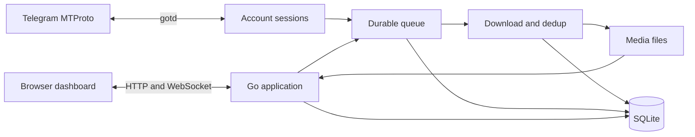

# Architecture

`core-service/cmd/tgdl-server` is the production process. It serves the embedded
browser assets, HTTP API, media and WebSocket connections, and owns SQLite and
Telegram account lifetimes through [gotd](https://gotd.dev/). There is no
JavaScript server or runtime fallback; the browser JavaScript is embedded in
the binary and runs only in the browser. The build does not need npm, a bundler
or generated source outside the Go module. ffmpeg is the only external program
the server calls (thumbnails and MP4 faststart).

```mermaid
flowchart LR
    browser[Browser dashboard] <-- HTTP and WebSocket --> app[Go application]
    telegram[Telegram MTProto] <-- gotd --> accounts[Account sessions]
    accounts --> engine[Durable queue]
    app --> engine
    engine --> download[Download and dedup]
    download --> files[Media files]
    download --> db[(SQLite)]
    engine --> db
    app --> db
    files --> app
```

## Ownership

| Package under `core-service/internal/` | Responsibility |
|---|---|
| `app` | HTTP policy, authentication gates, APIs, WebSocket events and job integration |
| `accounts`, `telegram`, `session` | Login, encrypted sessions, account ownership, gotd updates and media transport |
| `engine` | Durable queue claims, ordering, cancellation, retry, account lifecycle and monitor coordination |
| `download`, `filepublish` | Metadata dedup, verified byte reuse, streaming SHA-256, exclusive publication and recovery journals |
| `store`, `dbread` | SQLite migrations, transactional writes and bounded read projections |
| `auth` | Password hashes, web sessions and credential revocation |
| `webassets/public` | Browser ES modules, prebuilt styles and static pages embedded in the binary |
| `backup`, `cluster`, `rescue` | Backups and offline restore, peer pairing and catalog sync, rescue retention |
| `thumbs`, `faststart`, `jobs` | Thumbnails, MP4 faststart rewrites and tracked background jobs |

`cmd/tgdl-core` and packages such as `api`, `front`, `dbscan` and `seekbar`
belong to the 2.x companion binary. They still compile and keep protocol and
filesystem helpers, but `tgdl-core` is not built for releases or images. The
only application build and release target is `cmd/tgdl-server`.

## Durable download flow

Fresh Telegram metadata supplies lossless media/message identities before a
transfer is accepted. Work is persisted and claimed exclusively, including
message edit ordering. Existing catalog identities are checked against actual
files; verified content may serve several message rows. Transfers hash bytes as
they arrive and publish with an exclusive rename, so a concurrent destination
cannot be overwritten. Journals allow a published file to be registered after a
restart without downloading it again. Deleting one catalog owner preserves
bytes still referenced by another owner.

This behavior is covered by native fixture and integration tests in
`internal/download`, `internal/engine` and `internal/app`.

## State and process boundaries

`TGDL_DATA_DIR` contains `db.sqlite`, encrypted account sessions, downloads,
private keys, logs, generated previews and backups. Start exactly one server
writer per library. Process and account locks prevent duplicate ownership.
Configuration and web sessions are stored in SQLite; migrations run before
health becomes ready. Native setup talks to the running server over loopback,
rather than opening a second writer.

The media server confines file access to directory handles. Gallery paths honor
stored nested paths and distinguish existing root files from the historical
filename-only group layout. Permission errors never prove that a legacy file is
missing. Read requests and file deletion enforce authentication and shared-file
ownership independently of the browser.

On termination, HTTP requests drain, workers are canceled and joined, then the
owned database closes. Compose provides 60 seconds before a forced stop.

## Build and verification

Use `make build`, `make test` and `make check`. Go CI runs formatting, vet, race
tests and native/cross builds. Docker CI checks an actual candidate container
before publication. `scripts/build-server-release.sh` creates native archives
and SHA-256 checksums; tagged app releases must match the source AppVersion.

Historical route snapshots, schema and media fixtures remain under
`tests/contract/`. The removed backend and its Node harness are available in Git
at `aa83eed`. They document prior behavior rather than serving as a second
runtime. New behavior and security regressions are tested in Go.

The `faces-service`, `nsfw-service` and `seekbar-service` folders are separate
projects with their own release workflows. The 3.0 server does not call them;
see [AI](AI.md).

Further details: [deployment](DEPLOY.md), [configuration](CONFIGURATION.md),
and the engineering notes on [HTTP policy](GO-HTTP-SECURITY.md),
[session lifetime](GO-WEBSOCKET-SESSIONS.md), [history](GO-HISTORY.md),
[URL downloads](GO-URL-DOWNLOADS.md) and [recovery](GO-RECOVERY.md).
